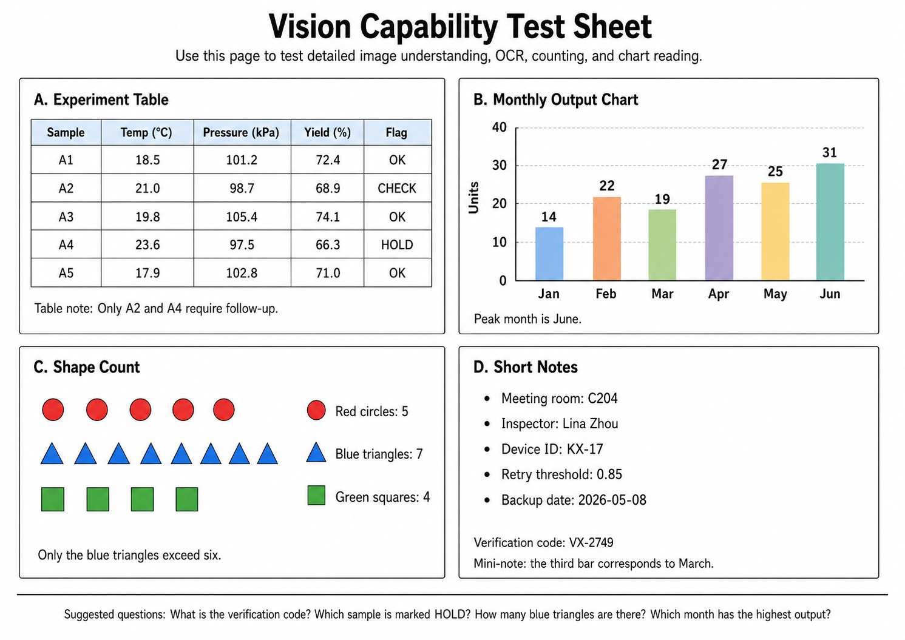

# Claudecode Vision MCP

> Give vision to non-vision Claude Code base models. / 为 Claude Code 中无原生视觉能力的基座模型提供识图能力。

[English](README.md) | [简体中文](README.zh-CN.md)

[](LICENSE)
[](https://www.python.org/)

Claudecode Vision MCP is a small MCP server for Claude Code. It lets base models that cannot read images directly, such as DeepSeek, local models, or non-vision text models, inspect images by calling a vision-capable OpenAI-compatible API.

DeepSeek is the main tested use case, but the server is model-agnostic: any Claude Code base model can use it if it follows the project instructions and calls MCP tools.

## How It Works

```text
User sends or references an image in Claude Code
          |
          v
  Non-vision base model receives an image path or unsupported-image marker
          |
          v
  Model calls describe_image(image_path, question)
          |
          v
  MCP server reads the local file and sends it as a base64 data URL
          |
          v
  Vision API returns a text description
          |
          v
  Non-vision model answers using that text
```

## Example: Before vs After

The image below is a simple capability sheet designed to test OCR, table extraction, chart reading, shape counting, and short-note lookup. The same detailed prompt was used with a non-vision Claude Code base model before and after enabling this MCP server.



| Task | Without this MCP server | With this MCP server |
| --- | --- | --- |
| Read the image | The model reported `[Unsupported Image]` and did not guess. | The model used `describe_image` and returned structured image content. |
| Main title | `uncertain` | `Vision Capability Test Sheet` |
| A. Experiment table | All sample fields were `uncertain`. | Extracted A1-A5 values, including A4 as `HOLD` with Temp `23.6`, Pressure `97.5`, Yield `66.3`. |
| Follow-up samples | Empty result. | `A2`, `A4` |
| B. Monthly output chart | Jan-Jun values were `null`. | Jan `14`, Feb `22`, Mar `19`, Apr `27`, May `25`, Jun `31`; peak month `June`. |
| C. Shape count | Shape counts were `null`. | Red circles `5`, blue triangles `7`, green squares `4`; blue triangles exceed six. |
| D. Short notes | Note fields were `uncertain`. | Meeting room `C204`, inspector `Lina Zhou`, device ID `KX-17`, retry threshold `0.85`, backup date `2026-05-08`. |
| Verification code | `uncertain` | `VX-2749` |

Summary: without a vision bridge, the base model correctly avoided fabricating answers but could not complete the visual task. With this MCP server, the same non-vision workflow can route the image through a vision-capable API and answer from the returned text. This is a functional demo, not a benchmark or an accuracy guarantee for every model, provider, or image.

## Prerequisites

- Python 3.10+
- Claude Code with MCP support
- An API key for a vision-capable OpenAI-compatible endpoint

## Quick Start

### 1. Clone and install

```bash
git clone https://github.com/look4yo/claudecode-vision-mcp.git
cd claudecode-vision-mcp
pip install -r requirements.txt
```

Conda example:

```bash
conda create -n vision-mcp python=3.12
conda activate vision-mcp
pip install -r requirements.txt
```

### 2. Configure the API

```bash
cp .env.example .env
# Edit .env and set VISION_API_KEY.
```

Provider links:

| Backend | API key page | Notes |
| --- | --- | --- |
| DashScope / Alibaba Qwen | [bailian.console.aliyun.com](https://bailian.console.aliyun.com/) | Default base URL in this repo. Recommended because Alibaba Cloud Model Studio often provides generous new-user free quotas for multimodal Qwen models; check the official quota page for current limits and validity. |
| OpenAI | [platform.openai.com/api-keys](https://platform.openai.com/api-keys) | Use a vision-capable chat model |
| Anthropic | [console.anthropic.com](https://console.anthropic.com/) | Requires an OpenAI-compatible gateway such as LiteLLM |
| Other providers | Provider docs | Must support `/chat/completions` with `image_url` input |

### 3. Register in Claude Code

User-level registration:

```bash
claude mcp add vision -- python /absolute/path/to/claudecode-vision-mcp/server.py
```

Windows example:

```powershell
claude mcp add vision -- C:\Users\you\.conda\envs\vision-mcp\python.exe D:\tools\claudecode-vision-mcp\server.py
```

Project-level `.mcp.json` example:

```json
{
  "mcpServers": {
    "vision": {
      "command": "python",
      "args": ["/absolute/path/to/claudecode-vision-mcp/server.py"]
    }
  }
}
```

Windows project-level example:

```json
{
  "mcpServers": {
    "vision": {
      "command": "C:\\Users\\you\\.conda\\envs\\vision-mcp\\python.exe",
      "args": ["D:\\tools\\claudecode-vision-mcp\\server.py"]
    }
  }
}
```

### 4. Tell your base model when to use it

Add instructions like this to your project `CLAUDE.md`:

```markdown
## Image Recognition

Your underlying model does not have native vision capability. When the user
sends an image, references an image path, or you see an unsupported-image
marker, call the `describe_image` MCP tool before answering.

Do not use the Read tool for binary image files. Use:

describe_image(image_path="/absolute/path/to/image.png", question="Describe the image in detail")
```

Automatic use depends on the base model following these instructions. If a weaker model does not call the tool by itself, ask it explicitly:

```text
Use describe_image on D:\path\to\image.png and answer based on the result.
```

## Configuration

The server loads `.env` from the same directory as `server.py`.

```bash
VISION_API_KEY=sk-your-key-here
VISION_API_BASE_URL=https://dashscope.aliyuncs.com/compatible-mode/v1
VISION_MAX_TOKENS=4096
VISION_MODELS=qwen3.5-plus,qwen3.5-omni-plus-2026-03-15,qwen3.5-omni-plus
```

`VISION_MODELS` is optional. When omitted or empty, the server uses:

```text
qwen3.5-plus -> qwen3.5-omni-plus-2026-03-15 -> qwen3.5-omni-plus
```

Fallback is only used for retryable failures such as quota, model unavailable, not found, rate limiting, or service unavailable. Configuration and authentication errors such as `400`, `401`, and `403` are returned directly.

## Backend Examples

DashScope / Alibaba Qwen:

```bash
VISION_API_KEY=sk-xxxxxxxxxxxxxxxx
VISION_API_BASE_URL=https://dashscope.aliyuncs.com/compatible-mode/v1
VISION_MODELS=qwen3.5-plus,qwen3.5-omni-plus
```

OpenAI:

```bash
VISION_API_KEY=sk-xxxxxxxxxxxxxxxx
VISION_API_BASE_URL=https://api.openai.com/v1
VISION_MODELS=gpt-4o,gpt-4o-mini
```

Any OpenAI-compatible endpoint works if it accepts chat-completions requests containing:

```json
{"type": "image_url", "image_url": {"url": "data:image/png;base64,..."}}
```

## Tool

`describe_image`

| Argument | Required | Description |
| --- | --- | --- |
| `image_path` | Yes | Absolute path to a local image file |
| `question` | No | Specific question about the image; defaults to a detailed description request |

Supported extensions: `.jpg`, `.jpeg`, `.png`, `.gif`, `.webp`, `.bmp`, `.tiff`, `.tif`.

## Applicability

Works best with Claude Code base models that can follow tool-use instructions:

| Base model type | Expected status |
| --- | --- |
| DeepSeek in Claude Code | Tested primary use case |
| Local text models via Claude Code providers | Compatible if they call MCP tools reliably |
| Non-vision hosted models | Compatible if they can use MCP tools |
| Native vision models | Usually unnecessary |

## Troubleshooting

| Problem | Fix |
| --- | --- |
| `describe_image` tool not visible | Run `claude mcp list`, then re-add the server if missing |
| Missing API key | Set `VISION_API_KEY` in `.env` or the process environment |
| API returns `401` or `403` | Check API key, region, provider permissions, and base URL |
| API returns `400` | Check whether the selected model supports `image_url` chat-completions input |
| All models fail | Check `VISION_MODELS`, `VISION_API_BASE_URL`, provider quota, and network access |
| Image not found | Use an absolute path and confirm Claude Code can access the file |
| Model does not call the tool automatically | Strengthen `CLAUDE.md` instructions or invoke `describe_image` manually |

## License

MIT. See [LICENSE](LICENSE).
